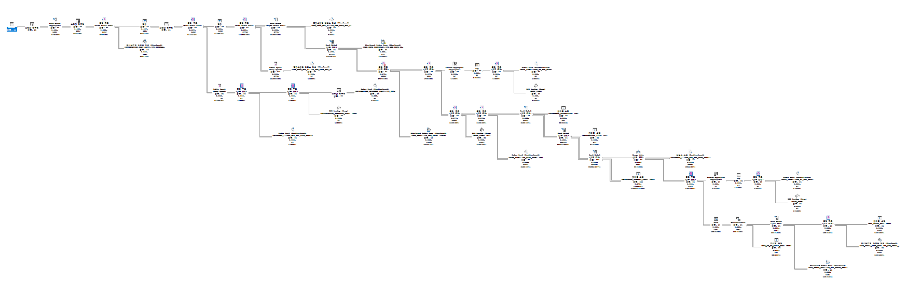

# 빠른 쿼리의 SQL Trace 분석
## Description
MS SQL이 생성한 Graphical SQL Plan의 맨 우측부터 분석을 시작하여 분할 정복 방식으로 Text SQL Plan을 작성하였습니다. Text SQL Plan의
화살표 우측에는 테이블 탐색 결과, 인덱스 탐색 결과, 조인 결과에 따른 Row 수를 기입하였습니다.
## Graphical SQL Plan

## Text SQL Plan(마지막이 최종)
자식 노드 간에는 위에서 아래로, 부모-자식 노드 간에는 안쪽에서 바깥쪽으로 진행합니다.
```text
NESTED LOOP --> 109행
    TABLE FULL SCAN(XST_SKILL_MST) --> 109행
    INDEX RANGE SCAN(XST_SKILL_CODE_MST) --> 109행
```
***
```text
HASH JOIN --> 110행
    NESTED LOOP --> 109행
        TABLE FULL SCAN(XST_SKILL_MST) --> 109행
        INDEX RANGE SCAN(PK_XST_SKILL_CODE_MST) --> 109행
    TABLE ACCESS BY INDEX ROWID --> 110행
        INDEX RANGE SCAN(PK_XST_QUEUE_REL) --> 228행
```
***
```text
UNION-ALL --> 168행
    HASH JOIN --> 110행
        NESTED LOOP --> 109행
            TABLE FULL SCAN(XST_SKILL_MST) --> 109행
            INDEX RANGE SCAN(PK_XST_SKILL_CODE_MST) --> 109행
        TABLE ACCESS BY INDEX ROWID --> 110행
            INDEX RANGE SCAN(PK_XST_QUEUE_REL) --> 228행
    TABLE FULL SCAN(TXS_ST_VQ_SKILL_FIX) --> 58행
```
***
```text
SORT ORDER BY --> 168행
    UNION-ALL --> 168행
        HASH JOIN --> 110행
            NESTED LOOP --> 109행
                TABLE FULL SCAN(XST_SKILL_MST) --> 109행
                INDEX RANGE SCAN(PK_XST_SKILL_CODE_MST) --> 109행
            TABLE ACCESS BY INDEX ROWID --> 110행
                INDEX RANGE SCAN(PK_XST_QUEUE_REL) --> 228행
        TABLE FULL SCAN(TXS_ST_VQ_SKILL_FIX) --> 58행
```
***
```text
NESTED LOOP --> 168행
    SORT AGGREGATE --> 1행
        COUNT(STOP KEY) --> 1행
            NESTED LOOP --> 2행
                INDEX RANGE SCAN(IDX_DT_CAL_DATE) --> 2행
                TABLE ACCESS BY USER ROWID(DATE_TIME) --> 2행
    SORT ORDER BY --> 168행
        UNION-ALL --> 168행
            HASH JOIN --> 110행
                NESTED LOOP --> 109행
                    TABLE FULL SCAN(XST_SKILL_MST) --> 109행
                    INDEX RANGE SCAN(PK_XST_SKILL_CODE_MST) --> 109행
                TABLE ACCESS BY INDEX ROWID --> 110행
                    INDEX RANGE SCAN(PK_XST_QUEUE_REL) --> 228행
            TABLE FULL SCAN(TXS_ST_VQ_SKILL_FIX) --> 58행
```
***
```text
MERGE JOIN --> 168행
    INDEX RANGE SCAN(IDX_RES_KEY_TYPE_CODE) --> 2292행
    NESTED LOOP --> 168행
        SORT AGGREGATE --> 1행
            COUNT(STOP KEY) --> 1행
                NESTED LOOP --> 2행
                    INDEX RANGE SCAN(IDX_DT_CAL_DATE) --> 2행
                    TABLE ACCESS BY USER ROWID(DATE_TIME) --> 2행
        SORT ORDER BY --> 168행
            UNION-ALL --> 168행
                HASH JOIN --> 110행
                    NESTED LOOP --> 109행
                        TABLE FULL SCAN(XST_SKILL_MST) --> 109행
                        INDEX RANGE SCAN(PK_XST_SKILL_CODE_MST) --> 109행
                    TABLE ACCESS BY INDEX ROWID --> 110행
                        INDEX RANGE SCAN(PK_XST_QUEUE_REL) --> 228행
                TABLE FULL SCAN(TXS_ST_VQ_SKILL_FIX) --> 58행
```
***
```text
HASH JOIN --> 62846행
    MERGE JOIN --> 168행
        INDEX RANGE SCAN(IDX_RES_KEY_TYPE_CODE) --> 2292행
        NESTED LOOP --> 168행
            SORT AGGREGATE --> 1행
                COUNT(STOP KEY) --> 1행
                    NESTED LOOP --> 2행
                        INDEX RANGE SCAN(IDX_DT_CAL_DATE) --> 2행
                        TABLE ACCESS BY USER ROWID(DATE_TIME) --> 2행
            SORT ORDER BY --> 168행
                UNION-ALL --> 168행
                    HASH JOIN --> 110행
                        NESTED LOOP --> 109행
                            TABLE FULL SCAN(XST_SKILL_MST) --> 109행
                            INDEX RANGE SCAN(PK_XST_SKILL_CODE_MST) --> 109행
                        TABLE ACCESS BY INDEX ROWID --> 110행
                            INDEX RANGE SCAN(PK_XST_QUEUE_REL) --> 228행
                    TABLE FULL SCAN(TXS_ST_VQ_SKILL_FIX) --> 58행
    TABLE FULL SCAN(MEDIATION_SEGMENT_FACT) --> 1479372행
```
***
```text
HASH JOIN --> 62846행
    TABLE FULL SCAN(INTERACTION_TYPE) --> 24행
    HASH JOIN --> 62846행
        MERGE JOIN --> 168행
            INDEX RANGE SCAN(IDX_RES_KEY_TYPE_CODE) --> 2292행
            NESTED LOOP --> 168행
                SORT AGGREGATE --> 1행
                    COUNT(STOP KEY) --> 1행
                        NESTED LOOP --> 2행
                            INDEX RANGE SCAN(IDX_DT_CAL_DATE) --> 2행
                            TABLE ACCESS BY USER ROWID(DATE_TIME) --> 2행
                SORT ORDER BY --> 168행
                    UNION-ALL --> 168행
                        HASH JOIN --> 110행
                            NESTED LOOP --> 109행
                                TABLE FULL SCAN(XST_SKILL_MST) --> 109행
                                INDEX RANGE SCAN(PK_XST_SKILL_CODE_MST) --> 109행
                            TABLE ACCESS BY INDEX ROWID --> 110행
                                INDEX RANGE SCAN(PK_XST_QUEUE_REL) --> 228행
                        TABLE FULL SCAN(TXS_ST_VQ_SKILL_FIX) --> 58행
        TABLE FULL SCAN(MEDIATION_SEGMENT_FACT) --> 1479372행
```
***
```text
HASH JOIN --> 4453행
    TABLE FULL SCAN(TECHNICAL_DESCRIPTOR) --> 63행
    HASH JOIN --> 62846행
        TABLE FULL SCAN(INTERACTION_TYPE) --> 24행
        HASH JOIN --> 62846행
            MERGE JOIN --> 168행
                INDEX RANGE SCAN(IDX_RES_KEY_TYPE_CODE) --> 2292행
                NESTED LOOP --> 168행
                    SORT AGGREGATE --> 1행
                        COUNT(STOP KEY) --> 1행
                            NESTED LOOP --> 2행
                                INDEX RANGE SCAN(IDX_DT_CAL_DATE) --> 2행
                                TABLE ACCESS BY USER ROWID(DATE_TIME) --> 2행
                    SORT ORDER BY --> 168행
                        UNION-ALL --> 168행
                            HASH JOIN --> 110행
                                NESTED LOOP --> 109행
                                    TABLE FULL SCAN(XST_SKILL_MST) --> 109행
                                    INDEX RANGE SCAN(PK_XST_SKILL_CODE_MST) --> 109행
                                TABLE ACCESS BY INDEX ROWID --> 110행
                                    INDEX RANGE SCAN(PK_XST_QUEUE_REL) --> 228행
                            TABLE FULL SCAN(TXS_ST_VQ_SKILL_FIX) --> 58행
            TABLE FULL SCAN(MEDIATION_SEGMENT_FACT) --> 1479372행
```
***
```text
NESTED LOOP --> 4453행
    HASH JOIN --> 4453행
        TABLE FULL SCAN(TECHNICAL_DESCRIPTOR) --> 63행
        HASH JOIN --> 62846행
            TABLE FULL SCAN(INTERACTION_TYPE) --> 24행
            HASH JOIN --> 62846행
                MERGE JOIN --> 168행
                    INDEX RANGE SCAN(IDX_RES_KEY_TYPE_CODE) --> 2292행
                    NESTED LOOP --> 168행
                        SORT AGGREGATE --> 1행
                            COUNT(STOP KEY) --> 1행
                                NESTED LOOP --> 2행
                                    INDEX RANGE SCAN(IDX_DT_CAL_DATE) --> 2행
                                    TABLE ACCESS BY USER ROWID(DATE_TIME) --> 2행
                        SORT ORDER BY --> 168행
                            UNION-ALL --> 168행
                                HASH JOIN --> 110행
                                    NESTED LOOP --> 109행
                                        TABLE FULL SCAN(XST_SKILL_MST) --> 109행
                                        INDEX RANGE SCAN(PK_XST_SKILL_CODE_MST) --> 109행
                                    TABLE ACCESS BY INDEX ROWID --> 110행
                                        INDEX RANGE SCAN(PK_XST_QUEUE_REL) --> 228행
                                TABLE FULL SCAN(TXS_ST_VQ_SKILL_FIX) --> 58행
                TABLE FULL SCAN(MEDIATION_SEGMENT_FACT) --> 1479372행
    INDEX RANGE SCAN(PK_DATE_TIME) --> 4453행
```
***
```text
NESTED LOOP --> 4453행
    NESTED LOOP --> 4453행
        HASH JOIN --> 4453행
            TABLE FULL SCAN(TECHNICAL_DESCRIPTOR) --> 63행
            HASH JOIN --> 62846행
                TABLE FULL SCAN(INTERACTION_TYPE) --> 24행
                HASH JOIN --> 62846행
                    MERGE JOIN --> 168행
                        INDEX RANGE SCAN(IDX_RES_KEY_TYPE_CODE) --> 2292행
                        NESTED LOOP --> 168행
                            SORT AGGREGATE --> 1행
                                COUNT(STOP KEY) --> 1행
                                    NESTED LOOP --> 2행
                                        INDEX RANGE SCAN(IDX_DT_CAL_DATE) --> 2행
                                        TABLE ACCESS BY USER ROWID(DATE_TIME) --> 2행
                            SORT ORDER BY --> 168행
                                UNION-ALL --> 168행
                                    HASH JOIN --> 110행
                                        NESTED LOOP --> 109행
                                            TABLE FULL SCAN(XST_SKILL_MST) --> 109행
                                            INDEX RANGE SCAN(PK_XST_SKILL_CODE_MST) --> 109행
                                        TABLE ACCESS BY INDEX ROWID --> 110행
                                            INDEX RANGE SCAN(PK_XST_QUEUE_REL) --> 228행
                                    TABLE FULL SCAN(TXS_ST_VQ_SKILL_FIX) --> 58행
                    TABLE FULL SCAN(MEDIATION_SEGMENT_FACT) --> 1479372행
        INDEX RANGE SCAN(PK_DATE_TIME) --> 4453행
    TABLE ACCESS BY USER ROWID(DATE_TIME) --> 4453행
```
***
```text
NESTED LOOP --> 163행
    SORT AGGREGATE --> 1행
        COUNT(STOP KEY) --> 1행
            NESTED LOOP --> 2행
                INDEX RANGE SCAN(IDX_DATE_CAL_DATE) --> 2행
                TABLE ACCESS BY USER ROWID(DATE_TIME) --> 2행
    NESTED LOOP --> 4453행
        NESTED LOOP --> 4453행
            HASH JOIN --> 4453행
                TABLE FULL SCAN(TECHNICAL_DESCRIPTOR) --> 63행
                HASH JOIN --> 62846행
                    TABLE FULL SCAN(INTERACTION_TYPE) --> 24행
                    HASH JOIN --> 62846행
                        MERGE JOIN --> 168행
                            INDEX RANGE SCAN(IDX_RES_KEY_TYPE_CODE) --> 2292행
                            NESTED LOOP --> 168행
                                SORT AGGREGATE --> 1행
                                    COUNT(STOP KEY) --> 1행
                                        NESTED LOOP --> 2행
                                            INDEX RANGE SCAN(IDX_DT_CAL_DATE) --> 2행
                                            TABLE ACCESS BY USER ROWID(DATE_TIME) --> 2행
                                SORT ORDER BY --> 168행
                                    UNION-ALL --> 168행
                                        HASH JOIN --> 110행
                                            NESTED LOOP --> 109행
                                                TABLE FULL SCAN(XST_SKILL_MST) --> 109행
                                                INDEX RANGE SCAN(PK_XST_SKILL_CODE_MST) --> 109행
                                            TABLE ACCESS BY INDEX ROWID --> 110행
                                                INDEX RANGE SCAN(PK_XST_QUEUE_REL) --> 228행
                                        TABLE FULL SCAN(TXS_ST_VQ_SKILL_FIX) --> 58행
                        TABLE FULL SCAN(MEDIATION_SEGMENT_FACT) --> 1479372행
            INDEX RANGE SCAN(PK_DATE_TIME) --> 4453행
        TABLE ACCESS BY USER ROWID(DATE_TIME) --> 4453행
```
***
```text
NESTED LOOP --> 1956행
    NESTED LOOP --> 163행
        SORT AGGREGATE --> 1행
            COUNT(STOP KEY) --> 1행
                NESTED LOOP --> 2행
                    INDEX RANGE SCAN(IDX_DATE_CAL_DATE) --> 2행
                    TABLE ACCESS BY USER ROWID(DATE_TIME) --> 2행
        NESTED LOOP --> 4453행
            NESTED LOOP --> 4453행
                HASH JOIN --> 4453행
                    TABLE FULL SCAN(TECHNICAL_DESCRIPTOR) --> 63행
                    HASH JOIN --> 62846행
                        TABLE FULL SCAN(INTERACTION_TYPE) --> 24행
                        HASH JOIN --> 62846행
                            MERGE JOIN --> 168행
                                INDEX RANGE SCAN(IDX_RES_KEY_TYPE_CODE) --> 2292행
                                NESTED LOOP --> 168행
                                    SORT AGGREGATE --> 1행
                                        COUNT(STOP KEY) --> 1행
                                            NESTED LOOP --> 2행
                                                INDEX RANGE SCAN(IDX_DT_CAL_DATE) --> 2행
                                                TABLE ACCESS BY USER ROWID(DATE_TIME) --> 2행
                                    SORT ORDER BY --> 168행
                                        UNION-ALL --> 168행
                                            HASH JOIN --> 110행
                                                NESTED LOOP --> 109행
                                                    TABLE FULL SCAN(XST_SKILL_MST) --> 109행
                                                    INDEX RANGE SCAN(PK_XST_SKILL_CODE_MST) --> 109행
                                                TABLE ACCESS BY INDEX ROWID --> 110행
                                                    INDEX RANGE SCAN(PK_XST_QUEUE_REL) --> 228행
                                            TABLE FULL SCAN(TXS_ST_VQ_SKILL_FIX) --> 58행
                            TABLE FULL SCAN(MEDIATION_SEGMENT_FACT) --> 1479372행
                INDEX RANGE SCAN(PK_DATE_TIME) --> 4453행
            TABLE ACCESS BY USER ROWID(DATE_TIME) --> 4453행
    INDEX RANGE SCAN(PK_AGR_SCFG) --> 1956행
```
***
```text
HASH JOIN --> 2771행
    INDEX RANGE SCAN(PK_AGR_SCFG_SCHEDULE) --> 17행
    NESTED LOOP --> 1956행
        NESTED LOOP --> 163행
            SORT AGGREGATE --> 1행
                COUNT(STOP KEY) --> 1행
                    NESTED LOOP --> 2행
                        INDEX RANGE SCAN(IDX_DATE_CAL_DATE) --> 2행
                        TABLE ACCESS BY USER ROWID(DATE_TIME) --> 2행
            NESTED LOOP --> 4453행
                NESTED LOOP --> 4453행
                    HASH JOIN --> 4453행
                        TABLE FULL SCAN(TECHNICAL_DESCRIPTOR) --> 63행
                        HASH JOIN --> 62846행
                            TABLE FULL SCAN(INTERACTION_TYPE) --> 24행
                            HASH JOIN --> 62846행
                                MERGE JOIN --> 168행
                                    INDEX RANGE SCAN(IDX_RES_KEY_TYPE_CODE) --> 2292행
                                    NESTED LOOP --> 168행
                                        SORT AGGREGATE --> 1행
                                            COUNT(STOP KEY) --> 1행
                                                NESTED LOOP --> 2행
                                                    INDEX RANGE SCAN(IDX_DT_CAL_DATE) --> 2행
                                                    TABLE ACCESS BY USER ROWID(DATE_TIME) --> 2행
                                        SORT ORDER BY --> 168행
                                            UNION-ALL --> 168행
                                                HASH JOIN --> 110행
                                                    NESTED LOOP --> 109행
                                                        TABLE FULL SCAN(XST_SKILL_MST) --> 109행
                                                        INDEX RANGE SCAN(PK_XST_SKILL_CODE_MST) --> 109행
                                                    TABLE ACCESS BY INDEX ROWID --> 110행
                                                        INDEX RANGE SCAN(PK_XST_QUEUE_REL) --> 228행
                                                TABLE FULL SCAN(TXS_ST_VQ_SKILL_FIX) --> 58행
                                TABLE FULL SCAN(MEDIATION_SEGMENT_FACT) --> 1479372행
                    INDEX RANGE SCAN(PK_DATE_TIME) --> 4453행
                TABLE ACCESS BY USER ROWID(DATE_TIME) --> 4453행
        INDEX RANGE SCAN(PK_AGR_SCFG) --> 1956행
```
***
```text
HASH JOIN(OUTER) --> 2771행
    INDEX RANGE SCAN(PK_AGR_SCFG_MAP_I) --> 1행
    HASH JOIN --> 2771행
        INDEX RANGE SCAN(PK_AGR_SCFG_SCHEDULE) --> 17행
        NESTED LOOP --> 1956행
            NESTED LOOP --> 163행
                SORT AGGREGATE --> 1행
                    COUNT(STOP KEY) --> 1행
                        NESTED LOOP --> 2행
                            INDEX RANGE SCAN(IDX_DATE_CAL_DATE) --> 2행
                            TABLE ACCESS BY USER ROWID(DATE_TIME) --> 2행
                NESTED LOOP --> 4453행
                    NESTED LOOP --> 4453행
                        HASH JOIN --> 4453행
                            TABLE FULL SCAN(TECHNICAL_DESCRIPTOR) --> 63행
                            HASH JOIN --> 62846행
                                TABLE FULL SCAN(INTERACTION_TYPE) --> 24행
                                HASH JOIN --> 62846행
                                    MERGE JOIN --> 168행
                                        INDEX RANGE SCAN(IDX_RES_KEY_TYPE_CODE) --> 2292행
                                        NESTED LOOP --> 168행
                                            SORT AGGREGATE --> 1행
                                                COUNT(STOP KEY) --> 1행
                                                    NESTED LOOP --> 2행
                                                        INDEX RANGE SCAN(IDX_DT_CAL_DATE) --> 2행
                                                        TABLE ACCESS BY USER ROWID(DATE_TIME) --> 2행
                                            SORT ORDER BY --> 168행
                                                UNION-ALL --> 168행
                                                    HASH JOIN --> 110행
                                                        NESTED LOOP --> 109행
                                                            TABLE FULL SCAN(XST_SKILL_MST) --> 109행
                                                            INDEX RANGE SCAN(PK_XST_SKILL_CODE_MST) --> 109행
                                                        TABLE ACCESS BY INDEX ROWID --> 110행
                                                            INDEX RANGE SCAN(PK_XST_QUEUE_REL) --> 228행
                                                    TABLE FULL SCAN(TXS_ST_VQ_SKILL_FIX) --> 58행
                                    TABLE FULL SCAN(MEDIATION_SEGMENT_FACT) --> 1479372행
                        INDEX RANGE SCAN(PK_DATE_TIME) --> 4453행
                    TABLE ACCESS BY USER ROWID(DATE_TIME) --> 4453행
            INDEX RANGE SCAN(PK_AGR_SCFG) --> 1956행
```
***
```text
NESTED LOOP(OUTER) --> 2771행
    HASH JOIN(OUTER) --> 2771행
        INDEX RANGE SCAN(PK_AGR_SCFG_MAP_I) --> 1행
        HASH JOIN --> 2771행
            INDEX RANGE SCAN(PK_AGR_SCFG_SCHEDULE) --> 17행
            NESTED LOOP --> 1956행
                NESTED LOOP --> 163행
                    SORT AGGREGATE --> 1행
                        COUNT(STOP KEY) --> 1행
                            NESTED LOOP --> 2행
                                INDEX RANGE SCAN(IDX_DATE_CAL_DATE) --> 2행
                                TABLE ACCESS BY USER ROWID(DATE_TIME) --> 2행
                    NESTED LOOP --> 4453행
                        NESTED LOOP --> 4453행
                            HASH JOIN --> 4453행
                                TABLE FULL SCAN(TECHNICAL_DESCRIPTOR) --> 63행
                                HASH JOIN --> 62846행
                                    TABLE FULL SCAN(INTERACTION_TYPE) --> 24행
                                    HASH JOIN --> 62846행
                                        MERGE JOIN --> 168행
                                            INDEX RANGE SCAN(IDX_RES_KEY_TYPE_CODE) --> 2292행
                                            NESTED LOOP --> 168행
                                                SORT AGGREGATE --> 1행
                                                    COUNT(STOP KEY) --> 1행
                                                        NESTED LOOP --> 2행
                                                            INDEX RANGE SCAN(IDX_DT_CAL_DATE) --> 2행
                                                            TABLE ACCESS BY USER ROWID(DATE_TIME) --> 2행
                                                SORT ORDER BY --> 168행
                                                    UNION-ALL --> 168행
                                                        HASH JOIN --> 110행
                                                            NESTED LOOP --> 109행
                                                                TABLE FULL SCAN(XST_SKILL_MST) --> 109행
                                                                INDEX RANGE SCAN(PK_XST_SKILL_CODE_MST) --> 109행
                                                            TABLE ACCESS BY INDEX ROWID --> 110행
                                                                INDEX RANGE SCAN(PK_XST_QUEUE_REL) --> 228행
                                                        TABLE FULL SCAN(TXS_ST_VQ_SKILL_FIX) --> 58행
                                        TABLE FULL SCAN(MEDIATION_SEGMENT_FACT) --> 1479372행
                            INDEX RANGE SCAN(PK_DATE_TIME) --> 4453행
                        TABLE ACCESS BY USER ROWID(DATE_TIME) --> 4453행
                INDEX RANGE SCAN(PK_AGR_SCFG) --> 1956행
    MATERIALIZED VIEW --> 2771행
        INDEX RANGE SCAN(PK_AGR_SCFG_MAP_I) --> 1행
```
***
```text
FILTER OPERATION --> 163행
    NESTED LOOP(OUTER) --> 2771행
        HASH JOIN(OUTER) --> 2771행
            INDEX RANGE SCAN(PK_AGR_SCFG_MAP_I) --> 1행
            HASH JOIN --> 2771행
                INDEX RANGE SCAN(PK_AGR_SCFG_SCHEDULE) --> 17행
                NESTED LOOP --> 1956행
                    NESTED LOOP --> 163행
                        SORT AGGREGATE --> 1행
                            COUNT(STOP KEY) --> 1행
                                NESTED LOOP --> 2행
                                    INDEX RANGE SCAN(IDX_DATE_CAL_DATE) --> 2행
                                    TABLE ACCESS BY USER ROWID(DATE_TIME) --> 2행
                        NESTED LOOP --> 4453행
                            NESTED LOOP --> 4453행
                                HASH JOIN --> 4453행
                                    TABLE FULL SCAN(TECHNICAL_DESCRIPTOR) --> 63행
                                    HASH JOIN --> 62846행
                                        TABLE FULL SCAN(INTERACTION_TYPE) --> 24행
                                        HASH JOIN --> 62846행
                                            MERGE JOIN --> 168행
                                                INDEX RANGE SCAN(IDX_RES_KEY_TYPE_CODE) --> 2292행
                                                NESTED LOOP --> 168행
                                                    SORT AGGREGATE --> 1행
                                                        COUNT(STOP KEY) --> 1행
                                                            NESTED LOOP --> 2행
                                                                INDEX RANGE SCAN(IDX_DT_CAL_DATE) --> 2행
                                                                TABLE ACCESS BY USER ROWID(DATE_TIME) --> 2행
                                                    SORT ORDER BY --> 168행
                                                        UNION-ALL --> 168행
                                                            HASH JOIN --> 110행
                                                                NESTED LOOP --> 109행
                                                                    TABLE FULL SCAN(XST_SKILL_MST) --> 109행
                                                                    INDEX RANGE SCAN(PK_XST_SKILL_CODE_MST) --> 109행
                                                                TABLE ACCESS BY INDEX ROWID --> 110행
                                                                    INDEX RANGE SCAN(PK_XST_QUEUE_REL) --> 228행
                                                            TABLE FULL SCAN(TXS_ST_VQ_SKILL_FIX) --> 58행
                                            TABLE FULL SCAN(MEDIATION_SEGMENT_FACT) --> 1479372행
                                INDEX RANGE SCAN(PK_DATE_TIME) --> 4453행
                            TABLE ACCESS BY USER ROWID(DATE_TIME) --> 4453행
                    INDEX RANGE SCAN(PK_AGR_SCFG) --> 1956행
        MATERIALIZED VIEW --> 2771행
            INDEX RANGE SCAN(PK_AGR_SCFG_MAP_I) --> 1행
```
***
```text
NESTED LOOP(OUTER) --> 163행
    FILTER OPERATION --> 163행
        NESTED LOOP(OUTER) --> 2771행
            HASH JOIN(OUTER) --> 2771행
                INDEX RANGE SCAN(PK_AGR_SCFG_MAP_I) --> 1행
                HASH JOIN --> 2771행
                    INDEX RANGE SCAN(PK_AGR_SCFG_SCHEDULE) --> 17행
                    NESTED LOOP --> 1956행
                        NESTED LOOP --> 163행
                            SORT AGGREGATE --> 1행
                                COUNT(STOP KEY) --> 1행
                                    NESTED LOOP --> 2행
                                        INDEX RANGE SCAN(IDX_DATE_CAL_DATE) --> 2행
                                        TABLE ACCESS BY USER ROWID(DATE_TIME) --> 2행
                            NESTED LOOP --> 4453행
                                NESTED LOOP --> 4453행
                                    HASH JOIN --> 4453행
                                        TABLE FULL SCAN(TECHNICAL_DESCRIPTOR) --> 63행
                                        HASH JOIN --> 62846행
                                            TABLE FULL SCAN(INTERACTION_TYPE) --> 24행
                                            HASH JOIN --> 62846행
                                                MERGE JOIN --> 168행
                                                    INDEX RANGE SCAN(IDX_RES_KEY_TYPE_CODE) --> 2292행
                                                    NESTED LOOP --> 168행
                                                        SORT AGGREGATE --> 1행
                                                            COUNT(STOP KEY) --> 1행
                                                                NESTED LOOP --> 2행
                                                                    INDEX RANGE SCAN(IDX_DT_CAL_DATE) --> 2행
                                                                    TABLE ACCESS BY USER ROWID(DATE_TIME) --> 2행
                                                        SORT ORDER BY --> 168행
                                                            UNION-ALL --> 168행
                                                                HASH JOIN --> 110행
                                                                    NESTED LOOP --> 109행
                                                                        TABLE FULL SCAN(XST_SKILL_MST) --> 109행
                                                                        INDEX RANGE SCAN(PK_XST_SKILL_CODE_MST) --> 109행
                                                                    TABLE ACCESS BY INDEX ROWID --> 110행
                                                                        INDEX RANGE SCAN(PK_XST_QUEUE_REL) --> 228행
                                                                TABLE FULL SCAN(TXS_ST_VQ_SKILL_FIX) --> 58행
                                                TABLE FULL SCAN(MEDIATION_SEGMENT_FACT) --> 1479372행
                                    INDEX RANGE SCAN(PK_DATE_TIME) --> 4453행
                                TABLE ACCESS BY USER ROWID(DATE_TIME) --> 4453행
                        INDEX RANGE SCAN(PK_AGR_SCFG) --> 1956행
            MATERIALIZED VIEW --> 2771행
                INDEX RANGE SCAN(PK_AGR_SCFG_MAP_I) --> 1행
    MATERIALIZED VIEW --> 9행
        NESTED LOOP --> 9행
            NESTED LOOP --> 9행
                INDEX RANGE SCAN(PK_INTERACTION_RESOURCE_FACT) --> 9행
                TABLE ACCESS BY USER ROWID(INTERACTION_RESOURCE_FACT) --> 9행
            INDEX RANGE SCAN(IDX_RES_KEY_TYPE_CODE) --> 9행
```
***
```text
NESTED LOOP(OUTER) --> 163행
    NESTED LOOP(OUTER) --> 163행
        FILTER OPERATION --> 163행
            NESTED LOOP(OUTER) --> 2771행
                HASH JOIN(OUTER) --> 2771행
                    INDEX RANGE SCAN(PK_AGR_SCFG_MAP_I) --> 1행
                    HASH JOIN --> 2771행
                        INDEX RANGE SCAN(PK_AGR_SCFG_SCHEDULE) --> 17행
                        NESTED LOOP --> 1956행
                            NESTED LOOP --> 163행
                                SORT AGGREGATE --> 1행
                                    COUNT(STOP KEY) --> 1행
                                        NESTED LOOP --> 2행
                                            INDEX RANGE SCAN(IDX_DATE_CAL_DATE) --> 2행
                                            TABLE ACCESS BY USER ROWID(DATE_TIME) --> 2행
                                NESTED LOOP --> 4453행
                                    NESTED LOOP --> 4453행
                                        HASH JOIN --> 4453행
                                            TABLE FULL SCAN(TECHNICAL_DESCRIPTOR) --> 63행
                                            HASH JOIN --> 62846행
                                                TABLE FULL SCAN(INTERACTION_TYPE) --> 24행
                                                HASH JOIN --> 62846행
                                                    MERGE JOIN --> 168행
                                                        INDEX RANGE SCAN(IDX_RES_KEY_TYPE_CODE) --> 2292행
                                                        NESTED LOOP --> 168행
                                                            SORT AGGREGATE --> 1행
                                                                COUNT(STOP KEY) --> 1행
                                                                    NESTED LOOP --> 2행
                                                                        INDEX RANGE SCAN(IDX_DT_CAL_DATE) --> 2행
                                                                        TABLE ACCESS BY USER ROWID(DATE_TIME) --> 2행
                                                            SORT ORDER BY --> 168행
                                                                UNION-ALL --> 168행
                                                                    HASH JOIN --> 110행
                                                                        NESTED LOOP --> 109행
                                                                            TABLE FULL SCAN(XST_SKILL_MST) --> 109행
                                                                            INDEX RANGE SCAN(PK_XST_SKILL_CODE_MST) --> 109행
                                                                        TABLE ACCESS BY INDEX ROWID --> 110행
                                                                            INDEX RANGE SCAN(PK_XST_QUEUE_REL) --> 228행
                                                                    TABLE FULL SCAN(TXS_ST_VQ_SKILL_FIX) --> 58행
                                                    TABLE FULL SCAN(MEDIATION_SEGMENT_FACT) --> 1479372행
                                        INDEX RANGE SCAN(PK_DATE_TIME) --> 4453행
                                    TABLE ACCESS BY USER ROWID(DATE_TIME) --> 4453행
                            INDEX RANGE SCAN(PK_AGR_SCFG) --> 1956행
                MATERIALIZED VIEW --> 2771행
                    INDEX RANGE SCAN(PK_AGR_SCFG_MAP_I) --> 1행
        MATERIALIZED VIEW --> 9행
            NESTED LOOP --> 9행
                NESTED LOOP --> 9행
                    INDEX RANGE SCAN(PK_INTERACTION_RESOURCE_FACT) --> 9행
                    TABLE ACCESS BY USER ROWID(INTERACTION_RESOURCE_FACT) --> 9행
                INDEX RANGE SCAN(IDX_RES_KEY_TYPE_CODE) --> 9행
    INDEX RANGE SCAN(PK_INTERACTION_FACT_CRYP) --> 163행
```
***
```text
HASH GROUP BY
    NESTED LOOP(OUTER) --> 163행
        NESTED LOOP(OUTER) --> 163행
            FILTER OPERATION --> 163행
                NESTED LOOP(OUTER) --> 2771행
                    HASH JOIN(OUTER) --> 2771행
                        INDEX RANGE SCAN(PK_AGR_SCFG_MAP_I) --> 1행
                        HASH JOIN --> 2771행
                            INDEX RANGE SCAN(PK_AGR_SCFG_SCHEDULE) --> 17행
                            NESTED LOOP --> 1956행
                                NESTED LOOP --> 163행
                                    SORT AGGREGATE --> 1행
                                        COUNT(STOP KEY) --> 1행
                                            NESTED LOOP --> 2행
                                                INDEX RANGE SCAN(IDX_DATE_CAL_DATE) --> 2행
                                                TABLE ACCESS BY USER ROWID(DATE_TIME) --> 2행
                                    NESTED LOOP --> 4453행
                                        NESTED LOOP --> 4453행
                                            HASH JOIN --> 4453행
                                                TABLE FULL SCAN(TECHNICAL_DESCRIPTOR) --> 63행
                                                HASH JOIN --> 62846행
                                                    TABLE FULL SCAN(INTERACTION_TYPE) --> 24행
                                                    HASH JOIN --> 62846행
                                                        MERGE JOIN --> 168행
                                                            INDEX RANGE SCAN(IDX_RES_KEY_TYPE_CODE) --> 2292행
                                                            NESTED LOOP --> 168행
                                                                SORT AGGREGATE --> 1행
                                                                    COUNT(STOP KEY) --> 1행
                                                                        NESTED LOOP --> 2행
                                                                            INDEX RANGE SCAN(IDX_DT_CAL_DATE) --> 2행
                                                                            TABLE ACCESS BY USER ROWID(DATE_TIME) --> 2행
                                                                SORT ORDER BY --> 168행
                                                                    UNION-ALL --> 168행
                                                                        HASH JOIN --> 110행
                                                                            NESTED LOOP --> 109행
                                                                                TABLE FULL SCAN(XST_SKILL_MST) --> 109행
                                                                                INDEX RANGE SCAN(PK_XST_SKILL_CODE_MST) --> 109행
                                                                            TABLE ACCESS BY INDEX ROWID --> 110행
                                                                                INDEX RANGE SCAN(PK_XST_QUEUE_REL) --> 228행
                                                                        TABLE FULL SCAN(TXS_ST_VQ_SKILL_FIX) --> 58행
                                                        TABLE FULL SCAN(MEDIATION_SEGMENT_FACT) --> 1479372행
                                            INDEX RANGE SCAN(PK_DATE_TIME) --> 4453행
                                        TABLE ACCESS BY USER ROWID(DATE_TIME) --> 4453행
                                INDEX RANGE SCAN(PK_AGR_SCFG) --> 1956행
                    MATERIALIZED VIEW --> 2771행
                        INDEX RANGE SCAN(PK_AGR_SCFG_MAP_I) --> 1행
            MATERIALIZED VIEW --> 9행
                NESTED LOOP --> 9행
                    NESTED LOOP --> 9행
                        INDEX RANGE SCAN(PK_INTERACTION_RESOURCE_FACT) --> 9행
                        TABLE ACCESS BY USER ROWID(INTERACTION_RESOURCE_FACT) --> 9행
                    INDEX RANGE SCAN(IDX_RES_KEY_TYPE_CODE) --> 9행
        INDEX RANGE SCAN(PK_INTERACTION_FACT_CRYP) --> 163행
```
## 최종 Text SQL Trace 분석
대체로 옵티마이저가 최적의 조인 경로를 생성해낸 것으로 보입니다. 하지만 상기 트레이스 내용을 확인하면서 들었던 몇 가지 의문을 하기에
정리하였습니다.

(1) TOP-N 쿼리를 통해서 단일 행 반환 이후 해당 행에 대해서 또 다시 집계 함수를 수행하는 내용이 있습니다.
```text
SORT AGGREGATE --> 1행
    COUNT(STOP KEY) --> 1행
        NESTED LOOP --> 2행
            INDEX RANGE SCAN(IDX_DATE_CAL_DATE) --> 2행
            TABLE ACCESS BY USER ROWID(DATE_TIME) --> 2행
```
불필요한 연산처럼 보이지만 일전에 삼성증권에 방문하였을 때 Dynamic SQL문으로 쓰이는 것을 보고 상기와 같은 쓰임새를 납득하였습니다.

(2) 유일하게 부하 지점으로 보이는 부분은 MEDIATION_SEGMENT_FACT 테이블을 FULL SCAN 하는 부분입니다. 일전에 삼성증권에서 해당 쿼리가
1분 40초나 걸리게 했던 부분이 MS SQL 옵티마이저가 생성한 SQL Plan에서도 전체 쿼리 소요 시간 중 많은 부분을 차지하고 있었습니다! 느린 쿼리와의
차이점은 하기에서 볼 수 있듯이 NESTED LOOP 조인이 아닌 HASH JOIN이라는 점입니다.
```text
HASH JOIN --> 62846행
    MERGE JOIN --> 168행
        INDEX RANGE SCAN(IDX_RES_KEY_TYPE_CODE) --> 2292행
        NESTED LOOP --> 168행
            SORT AGGREGATE --> 1행
                COUNT(STOP KEY) --> 1행
                    NESTED LOOP --> 2행
                        INDEX RANGE SCAN(IDX_DT_CAL_DATE) --> 2행
                        TABLE ACCESS BY USER ROWID(DATE_TIME) --> 2행
            SORT ORDER BY --> 168행
                UNION-ALL --> 168행
                    HASH JOIN --> 110행
                        NESTED LOOP --> 109행
                            TABLE FULL SCAN(XST_SKILL_MST) --> 109행
                            INDEX RANGE SCAN(PK_XST_SKILL_CODE_MST) --> 109행
                        TABLE ACCESS BY INDEX ROWID --> 110행
                            INDEX RANGE SCAN(PK_XST_QUEUE_REL) --> 228행
                    TABLE FULL SCAN(TXS_ST_VQ_SKILL_FIX) --> 58행
    TABLE FULL SCAN(MEDIATION_SEGMENT_FACT) --> 1479372행
```
전체 쿼리 수행 시간 0.494초 중에서 해당 HASH JOIN이 0.441초를 차지합니다. 전체 쿼리 소요 시간 중 89%입니다. MEDIATION_SEGMENT_FACT
테이블의 RESOURCE_KEY 컬럼에 인덱스가 없어서 168행의 RESOURCE_KEY 컬럼을 기준으로 해시 테이블을 만들고 1479372번 해시 테이블 탐색을
수행하여 62846행을 결과로 내놓았습니다. `1479372번 탐색하여 62846행만 결과로 내놓은 것은 전체 4.25%에 불과`하므로 굉장히 비효율적입니다.
따라서 MEDIATION_SEGMENT_FACT 테이블에 RESOURCE_KEY 컬럼에 대한 단일 컬럼 인덱스를 생성하고 NL 조인을 수행한다면 MEDIATION_SEGMENT_FACT
테이블로의 Random Access가 168번에 불과하므로 조인되는 데이터 중 결과 집합에서 누락되는 데이터가 없기에 훨씬 효율적이라고 볼 수 있습니다.
또한 만약에 MEDIATION_SEGMENT_FACT 테이블이 시간이 지남에 따라 데이터가 증가하는 테이블이라면 RESOURCE_KEY 컬럼에 단일 컬럼 인덱스가
있기 때문에 쿼리 소요 시간이 증가하지 않습니다.
## MS SQL Hint 사용 예시
### FROM 절에 테이블을 나열한 순으로 NL 조인
```mysql-sql
SELECT o.주문번호, o.고객번호, c.고객명, c.전화번호, o.주문금액
FROM 주문 o, 고객 c
WHERE o.주문일자 >= TRUNC(SYSDATE)
AND c.고객번호 = o.고객번호
OPTION (FORCE ORDER, LOOP JOIN)
```
### FROM 절에 테이블을 나열한 순으로 조인하되 조인 방식이 테이블마다 다를 때
```mysql-sql
SELECT o.주문번호, o.고객번호, c.고객명, c.전화번호, o.주문금액, t.결제방식명
FROM 주문 o 
     INNER LOOP JOIN 고객 c ON (c.고객번호 = o.고객번호)
     INNER HASH JOIN 결제방식 t ON (t.결제방식코드 = o.결제방식코드)
WHERE o.주문일자 >= TRUNC(SYSDATE)
OPTION (FORCE ORDER)
```