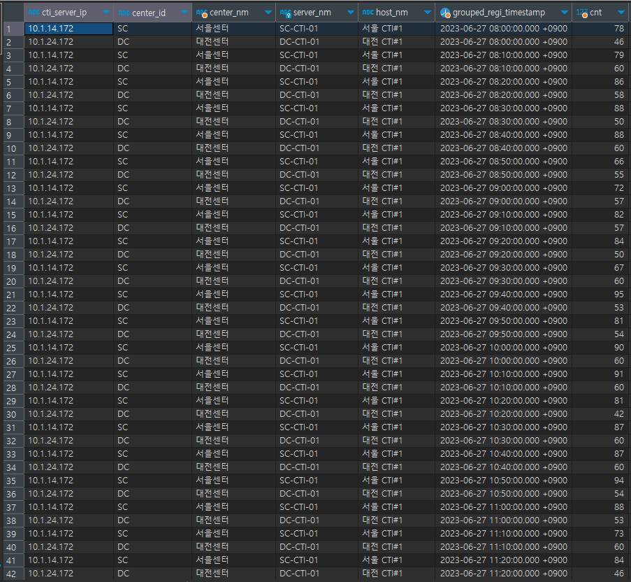

# 쿼리
```postgres-sql
select 
        a.cti_server_ip
        ,b.etc_2_ctnt as center_id
        ,case when b.etc_2_ctnt = 'SC' then '서을센터'
              when b.etc_2_ctnt = 'DC' then '대전센터' end as center_nm
        ,b.cd_id as server_nm
        ,b.cd_nm as host_nm
        ,a.grouped_regi_timestamp
        ,count(*) as cnt
from (select 
            t1.cti_server_ip as cti_server_ip
            ,t1.regi_timestamp as regi_timestamp
            ,case when (extract(minute from t1.regi_timestamp) / 10) between 0 and 0.9 then (0 * INTERVAL '10 minutes') + date_trunc('hour', t1.regi_timestamp)
                  when (extract(minute from t1.regi_timestamp) / 10) between 1 and 1.9 then (1 * INTERVAL '10 minutes') + date_trunc('hour', t1.regi_timestamp)
                  when (extract(minute from t1.regi_timestamp) / 10) between 2 and 2.9 then (2 * INTERVAL '10 minutes') + date_trunc('hour', t1.regi_timestamp)
                  when (extract(minute from t1.regi_timestamp) / 10) between 3 and 3.9 then (3 * INTERVAL '10 minutes') + date_trunc('hour', t1.regi_timestamp)
                  when (extract(minute from t1.regi_timestamp) / 10) between 4 and 4.9 then (4 * INTERVAL '10 minutes') + date_trunc('hour', t1.regi_timestamp)
                  when (extract(minute from t1.regi_timestamp) / 10) between 5 and 5.9 then (5 * INTERVAL '10 minutes') + date_trunc('hour', t1.regi_timestamp) end as grouped_regi_timestamp
      from isac_skeleton.vw_mc_vdn_incoming_test_tbl t1
      where t1.regi_dttm::date = current_date -8) a  --> 인덱스를 안 타는 문제 발생
inner join isac_skeleton.cm_std_cd b
on b.cd_type_id = 'CM101'::text
and b.etc_1_ctnt = a.cti_server_ip::text
group by  a.cti_server_ip, b.etc_2_ctnt, b.cd_id, b.cd_nm, a.grouped_regi_timestamp
order by a.grouped_regi_timestamp
```
regi_timestamp 컬럼으로부터 분을 추출하여 0부터 5.9 사이의 값으로 가공한다. 이후 각 구간을 대표하는 값으로 치환하여 다시 분으로 바꿔주고
분으로 바꾼 값을 시간을 기준으로 버림한 시각에 더해준다.
# 실행 결과

# 문제
```postgres-sql
where t1.regi_dttm::date = current_date -8) a  --> 인덱스를 안 타는 문제 발생
```
인덱스를 타지 않는 문제가 있다. 왜냐하면 regi_dttm 컬럼은 varchar 타입인데 date 타입으로 형변환을 수행하였기 때문이다. 따라서
where regi_dttm between to_char(current_date - 8, 'YYYY-MM-DD 00:00:00') and to_char(current_date - 8, 'YYYY-MM-DD 23:59:59')처럼도
바꿔보았지만 인덱스를 타지 않았다. 이에 대해 ChatGPT는 하기와 같은 답변을 내놓았다.  
```text
따라서 to_char(current_date - 8, 'YYYY-MM-DD 00:00:00')와 to_char(current_date - 8, 'YYYY-MM-DD 23:59:59')와 같이 동적으로
생성된 문자열 값을 사용하는 경우, 데이터 타입 불일치와 형변환의 한계로 인해 인덱스가 작동하지 않을 수 있습니다. 최적의 성능을 위해서는
regi_dttm 컬럼을 timestamp 또는 date와 같은 시간 관련 데이터 타입으로 변경하고, 해당 데이터 타입으로 비교 조건을 작성하는 것이 좋습니다.
그렇게 하면 데이터 타입 일치와 인덱스의 선택적인 효과를 향상시킬 수 있습니다.
```
