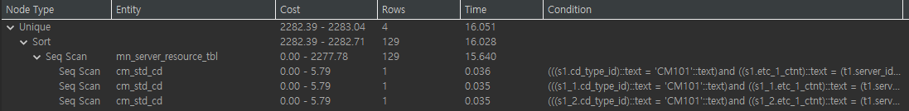
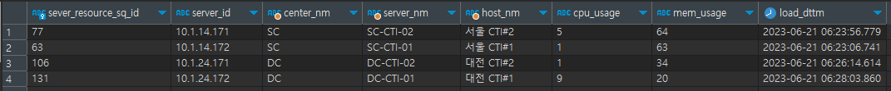

# CTIBridge 로그 조회 쿼리 튜닝 보고서
## SQL ID
vw_mn_server_resource_tbl  
## 원문 SQL
```postgres-sql
SELECT DISTINCT ON (t1.server_id)
    t1.server_resource_sq_id,
    t1.server_id,
    (SELECT s1.etc_2_ctnt
     FROM isac_skeleton.cm_std_cd s1
     WHERE s1.cd_type_id::text = 'CM101'::text AND s1.etc_1_ctnt::text = t1.server_id::text) AS center_nm,
    (SELECT s1.cd_id
     FROM isac_skeleton.cm_std_cd s1
     WHERE s1.cd_type_id::text = 'CM101'::text AND s1.etc_1_ctnt::text = t1.server_id::text) AS server_nm,
    (SELECT s1.cd_nm
     FROM isac_skeleton.cm_std_cd s1
     WHERE s1.cd_type_id::text = 'CM101'::text AND s1.etc_1_ctnt::text = t1.server_id::text) AS host_nm,
    t1.cpu_usage,
    t1.mem_usage,
    t1.load_dttm
FROM isac_skeleton.mn_server_resource_tbl t1
ORDER BY t1.server_id, t1.load_dttm DESC;
```
## 원문 SQL 실행 계획
  

| 튜닝 전 예상 소요 시간 |
|---------------|
| 16.051        |
## 원문 SQL 실행 결과

## 튜닝 포인트
