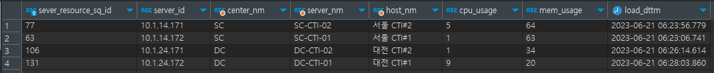

# 실시간 로그 조회 쿼리 튜닝 보고서
## SQL ID
vw_mn_server_resource_tbl  
## 원문 SQL
```postgres-sql
SELECT DISTINCT ON (t1.server_id)
    t1.server_resource_sq_id,
    t1.server_id,
    (SELECT s1.etc_2_ctnt
     FROM isac_skeleton.cm_std_cd s1
     WHERE s1.cd_type_id::text = 'CM101'::text AND s1.etc_1_ctnt::text = t1.server_id::text) AS center_nm,
    (SELECT s1.cd_id
     FROM isac_skeleton.cm_std_cd s1
     WHERE s1.cd_type_id::text = 'CM101'::text AND s1.etc_1_ctnt::text = t1.server_id::text) AS server_nm,
    (SELECT s1.cd_nm
     FROM isac_skeleton.cm_std_cd s1
     WHERE s1.cd_type_id::text = 'CM101'::text AND s1.etc_1_ctnt::text = t1.server_id::text) AS host_nm,
    t1.cpu_usage,
    t1.mem_usage,
    t1.load_dttm
FROM isac_skeleton.mn_server_resource_tbl t1
ORDER BY t1.server_id, t1.load_dttm DESC;
```
## 원문 SQL 실행 계획
  
- 튜닝 전 전체 비용 : `2283.04`
- 튜닝 전 읽은 버퍼 블록 수 : `1162`개
- 튜닝 전 예상 소요 시간 : `16.051`
- 튜닝 전 예상 로우 수 : `4`건
## 원문 SQL 실행 결과

## 튜닝 포인트
1. 실제 출력되는 로우의 수는 4건밖에 안 되는데 전체 129건에 대해서 스칼라 서브쿼리를 실행한다. 이것은 시스템의 CPU를 낭비하게 된다. 따라서
기존의 *스칼라 서브쿼리를 조인으로 바꾸고 최종 4건에 대해서만 조인*하도록 수정한다.
2. server_id, load_dttm 컬럼 내림차순을 기준으로 정렬하여 첫 번째 Row만 추출하는데 두 컬럼에 대한 인덱스가 없다. 이것은 매번 모든 데이터를
PGA에 정렬하여 메모리를 낭비하게 된다. 따라서 *server_id, load_dttm 컬럼 순서로 인덱스를 생성*하여 빠르게 조인할 데이터를 추출할 수 있도록
한다.
3. isac_skeleton.cm_std_cd 테이블은 코드성 테이블인 것 같다. 따라서 해시 조인을 통해서 isac_skeleton.cm_std_cd 테이블을 Build Input으로
정하고 isac_skeleton.mn_server_resource_tbl 테이블과 조인하면 될 것 같지만 Probe Input은 DISTINCT ON 과정을 통해서 몇 건 없을 수 있다.
그렇다면 오히려 코드성 테이블을 Full Scan하여 Build Input으로 만드는 과정이 메모리를 낭비하는 비효율적인 수행일 수 있으니 NL 조인을 통해서
isac_skeleton.mn_server_resource_tbl 테이블을 isac_skeleton.cm_std_cd 테이블과 조인하도록 한다.
## 튜닝 후 SQL
하기 순서와 같이 인덱스를 생성한다.
- `mn_server_resource_tbl_server_id_idx` : server_id + load_dttm
```postgres-sql
SELECT t2.server_resource_sq_id,
       t2.server_id,
       t3.etc_2_ctnt AS center_nm,
       t3.cd_id AS server_nm,
       t3.cd_nm AS host_nm,
       t2.cpu_usage,
       t2.mem_usage,
       t2.load_dttm
FROM (SELECT DISTINCT ON (t1.server_id) 
                          t1.server_resource_sq_id,
                          t1.server_id,
                          t1.cpu_usage,
                          t1.mem_usage,
                          t1.load_dttm
      FROM isac_skeleton.mn_server_resource_tbl t1
      ORDER BY t1.server_id, t1.load_dttm DESC) t2, isac_skeleton.cm_std_cd t3
WHERE t3.cd_type_id::text = 'CM101'::text 
AND t3.etc_1_ctnt::text = t2.server_id::text
ORDER BY t2.server_id, t2.load_dttm DESC
```
## 튜닝 후 SQL 실행 계획

- 튜닝 후 전체 비용 : `18.08`
- 튜닝 후 읽은 버퍼 블록 수 : `5`개
- 튜닝 후 예상 소요 시간 : `0.638`
- 튜닝 후 예상 로우 수 : `4`건

확실히 튜닝 이후에는 튜닝 전과 비교해 엄청난 성능 차이를 보여준다. 하지만 실행 계획을 살펴보면 기대한 Nested Loop 조인이 아닌 Merge Join을
수행한다. 또한, 앞서 만들어준 인덱스를 사용하는 것이 아닌 Full Scan(=Seq Scan)을 사용했다. 그 이유는 무엇일까?  
1. `NL 조인이 아닌 Merge Join을 수행한 이유` : 옵티마이저는 데이터 수와 같은 통계 데이터를 이용하여 실행 계획을 생성한다. 하지만 현재 각 테이블에는
테스트 용으로 삽입한 소수의 데이터들이 전부일 뿐이다. 따라서 올바른 데이터가 옵티마이저에게 제공되지 않았기 때문에 다소 부정확한 실행 계획이
생성된 것이다.
2. `Index가 아닌 Full Scan을 수행한 이유` : 앞서 말했듯이 데이터는 백 몇 건의 데이터밖에 존재하지 않는다. 보통 데이터베이스 블록 하나에는
몇 천 건의 로우가 한꺼번에 저장될 수 있다. 그렇다면 인덱스를 사용하든 Full Scan을 사용하든 어차피 테이블 블록 하나를 읽는 것은 동일하다.
따라서 옵티마이저가 Index 스캔 대신에 Full Scan을 선택한 것이다.
## 튜닝 후 SQL 실행 결과
