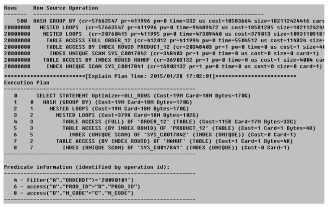

## 문제 링크
https://m.blog.naver.com/PostView.naver?blogId=oracledo&logNo=220390189725&navType=by

## 테이블 정보
| 테이블        | 데이터 수   | 비고                |
|------------|---------|-------------------|
| order_12   | 1.1억개   | 20090101 이후 2천만 개 |
| product_12 | 10,000개 |                   |
| manuf      | 500개    |                   |

## 인덱스 정보
| 인덱스            | 테이블        | 인덱스 이름          | 구성 컬럼   |
|----------------|------------|-----------------|---------|
| Non-Unique 인덱스 | order_12   | order_12_idx_01 | orderdt |
| PK 인덱스         | product_12 | product_12_pk   | prod_id |
| PK 인덱스         | manuf      | manuf_pk        | m_code  |

## 쿼리
```
SELECT DISTINCT b.m_code, c.m_name
FROM order_12 a, product_12 b, manuf c
WHERE a.orderdt >= '20090101'
AND a.prod_id = b.prod_id
AND b.m_code = c.m_code;
```
