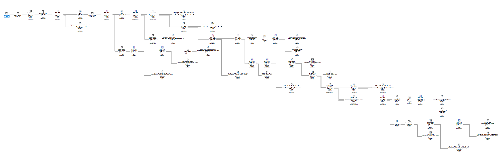

# 빠른 쿼리의 SQL Trace 분석
## Description
MS SQL이 생성한 Graphical SQL Plan의 맨 우측부터 분석을 시작하여 분할 정복 방식으로 Text SQL Plan을 작성하였습니다. Text SQL Plan의
화살표 우측에는 테이블 탐색 결과, 인덱스 탐색 결과, 조인 결과에 따른 Row 수를 기입하였습니다.
## Graphical SQL Plan

## Text SQL Plan
```text
NESTED LOOP --> 109행
    TABLE FULL SCAN(XST_SKILL_MST) --> 109행
    INDEX RANGE SCAN(XST_SKILL_CODE_MST) --> 109행
```
***
```text
HASH JOIN --> 110행
    NESTED LOOP --> 109행
        TABLE FULL SCAN(XST_SKILL_MST) --> 109행
        INDEX RANGE SCAN(PK_XST_SKILL_CODE_MST) --> 109행
    TABLE ACCESS BY INDEX ROWID --> 110행
        INDEX RANGE SCAN(PK_XST_QUEUE_REL) --> 228행
```
***
```text
UNION-ALL --> 168행
    HASH JOIN --> 110행
        NESTED LOOP --> 109행
            TABLE FULL SCAN(XST_SKILL_MST) --> 109행
            INDEX RANGE SCAN(PK_XST_SKILL_CODE_MST) --> 109행
        TABLE ACCESS BY INDEX ROWID --> 110행
            INDEX RANGE SCAN(PK_XST_QUEUE_REL) --> 228행
    TABLE FULL SCAN(TXS_ST_VQ_SKILL_FIX) --> 58행
```
***
```text
SORT ORDER BY --> 168행
    UNION-ALL --> 168행
        HASH JOIN --> 110행
            NESTED LOOP --> 109행
                TABLE FULL SCAN(XST_SKILL_MST) --> 109행
                INDEX RANGE SCAN(PK_XST_SKILL_CODE_MST) --> 109행
            TABLE ACCESS BY INDEX ROWID --> 110행
                INDEX RANGE SCAN(PK_XST_QUEUE_REL) --> 228행
        TABLE FULL SCAN(TXS_ST_VQ_SKILL_FIX) --> 58행
```
***
```text
NESTED LOOP --> 168행
    SORT AGGREGATE --> 1행
        COUNT(STOP KEY) --> 1행
            NESTED LOOP --> 2행
                INDEX RANGE SCAN(IDX_DT_CAL_DATE) --> 2행
                TABLE ACCESS BY USER ROWID(DATE_TIME) --> 2행
    SORT ORDER BY --> 168행
        UNION-ALL --> 168행
            HASH JOIN --> 110행
                NESTED LOOP --> 109행
                    TABLE FULL SCAN(XST_SKILL_MST) --> 109행
                    INDEX RANGE SCAN(PK_XST_SKILL_CODE_MST) --> 109행
                TABLE ACCESS BY INDEX ROWID --> 110행
                    INDEX RANGE SCAN(PK_XST_QUEUE_REL) --> 228행
            TABLE FULL SCAN(TXS_ST_VQ_SKILL_FIX) --> 58행
```
***
```text
MERGE JOIN --> 168행
    INDEX RANGE SCAN(IDX_RES_KEY_TYPE_CODE) --> 2292행
    NESTED LOOP --> 168행
        SORT AGGREGATE --> 1행
            COUNT(STOP KEY) --> 1행
                NESTED LOOP --> 2행
                    INDEX RANGE SCAN(IDX_DT_CAL_DATE) --> 2행
                    TABLE ACCESS BY USER ROWID(DATE_TIME) --> 2행
        SORT ORDER BY --> 168행
            UNION-ALL --> 168행
                HASH JOIN --> 110행
                    NESTED LOOP --> 109행
                        TABLE FULL SCAN(XST_SKILL_MST) --> 109행
                        INDEX RANGE SCAN(PK_XST_SKILL_CODE_MST) --> 109행
                    TABLE ACCESS BY INDEX ROWID --> 110행
                        INDEX RANGE SCAN(PK_XST_QUEUE_REL) --> 228행
                TABLE FULL SCAN(TXS_ST_VQ_SKILL_FIX) --> 58행
```
***
```text
HASH JOIN --> 62846행
    MERGE JOIN --> 168행
        INDEX RANGE SCAN(IDX_RES_KEY_TYPE_CODE) --> 2292행
        NESTED LOOP --> 168행
            SORT AGGREGATE --> 1행
                COUNT(STOP KEY) --> 1행
                    NESTED LOOP --> 2행
                        INDEX RANGE SCAN(IDX_DT_CAL_DATE) --> 2행
                        TABLE ACCESS BY USER ROWID(DATE_TIME) --> 2행
            SORT ORDER BY --> 168행
                UNION-ALL --> 168행
                    HASH JOIN --> 110행
                        NESTED LOOP --> 109행
                            TABLE FULL SCAN(XST_SKILL_MST) --> 109행
                            INDEX RANGE SCAN(PK_XST_SKILL_CODE_MST) --> 109행
                        TABLE ACCESS BY INDEX ROWID --> 110행
                            INDEX RANGE SCAN(PK_XST_QUEUE_REL) --> 228행
                    TABLE FULL SCAN(TXS_ST_VQ_SKILL_FIX) --> 58행
    TABLE FULL SCAN(MEDIATION_SEGMENT_FACT) --> 1479372행
```
***
```text
HASH JOIN --> 62846행
    TABLE FULL SCAN(INTERACTION_TYPE) --> 24행
    HASH JOIN --> 62846행
        MERGE JOIN --> 168행
            INDEX RANGE SCAN(IDX_RES_KEY_TYPE_CODE) --> 2292행
            NESTED LOOP --> 168행
                SORT AGGREGATE --> 1행
                    COUNT(STOP KEY) --> 1행
                        NESTED LOOP --> 2행
                            INDEX RANGE SCAN(IDX_DT_CAL_DATE) --> 2행
                            TABLE ACCESS BY USER ROWID(DATE_TIME) --> 2행
                SORT ORDER BY --> 168행
                    UNION-ALL --> 168행
                        HASH JOIN --> 110행
                            NESTED LOOP --> 109행
                                TABLE FULL SCAN(XST_SKILL_MST) --> 109행
                                INDEX RANGE SCAN(PK_XST_SKILL_CODE_MST) --> 109행
                            TABLE ACCESS BY INDEX ROWID --> 110행
                                INDEX RANGE SCAN(PK_XST_QUEUE_REL) --> 228행
                        TABLE FULL SCAN(TXS_ST_VQ_SKILL_FIX) --> 58행
        TABLE FULL SCAN(MEDIATION_SEGMENT_FACT) --> 1479372행
```
***
```text
HASH JOIN --> 4453행
    TABLE FULL SCAN(TECHNICAL_DESCRIPTOR) --> 63행
    HASH JOIN --> 62846행
        TABLE FULL SCAN(INTERACTION_TYPE) --> 24행
        HASH JOIN --> 62846행
            MERGE JOIN --> 168행
                INDEX RANGE SCAN(IDX_RES_KEY_TYPE_CODE) --> 2292행
                NESTED LOOP --> 168행
                    SORT AGGREGATE --> 1행
                        COUNT(STOP KEY) --> 1행
                            NESTED LOOP --> 2행
                                INDEX RANGE SCAN(IDX_DT_CAL_DATE) --> 2행
                                TABLE ACCESS BY USER ROWID(DATE_TIME) --> 2행
                    SORT ORDER BY --> 168행
                        UNION-ALL --> 168행
                            HASH JOIN --> 110행
                                NESTED LOOP --> 109행
                                    TABLE FULL SCAN(XST_SKILL_MST) --> 109행
                                    INDEX RANGE SCAN(PK_XST_SKILL_CODE_MST) --> 109행
                                TABLE ACCESS BY INDEX ROWID --> 110행
                                    INDEX RANGE SCAN(PK_XST_QUEUE_REL) --> 228행
                            TABLE FULL SCAN(TXS_ST_VQ_SKILL_FIX) --> 58행
            TABLE FULL SCAN(MEDIATION_SEGMENT_FACT) --> 1479372행
```
***
```text
NESTED LOOP --> 4453행
    HASH JOIN --> 4453행
        TABLE FULL SCAN(TECHNICAL_DESCRIPTOR) --> 63행
        HASH JOIN --> 62846행
            TABLE FULL SCAN(INTERACTION_TYPE) --> 24행
            HASH JOIN --> 62846행
                MERGE JOIN --> 168행
                    INDEX RANGE SCAN(IDX_RES_KEY_TYPE_CODE) --> 2292행
                    NESTED LOOP --> 168행
                        SORT AGGREGATE --> 1행
                            COUNT(STOP KEY) --> 1행
                                NESTED LOOP --> 2행
                                    INDEX RANGE SCAN(IDX_DT_CAL_DATE) --> 2행
                                    TABLE ACCESS BY USER ROWID(DATE_TIME) --> 2행
                        SORT ORDER BY --> 168행
                            UNION-ALL --> 168행
                                HASH JOIN --> 110행
                                    NESTED LOOP --> 109행
                                        TABLE FULL SCAN(XST_SKILL_MST) --> 109행
                                        INDEX RANGE SCAN(PK_XST_SKILL_CODE_MST) --> 109행
                                    TABLE ACCESS BY INDEX ROWID --> 110행
                                        INDEX RANGE SCAN(PK_XST_QUEUE_REL) --> 228행
                                TABLE FULL SCAN(TXS_ST_VQ_SKILL_FIX) --> 58행
                TABLE FULL SCAN(MEDIATION_SEGMENT_FACT) --> 1479372행
    INDEX RANGE SCAN(PK_DATE_TIME) --> 4453행
```