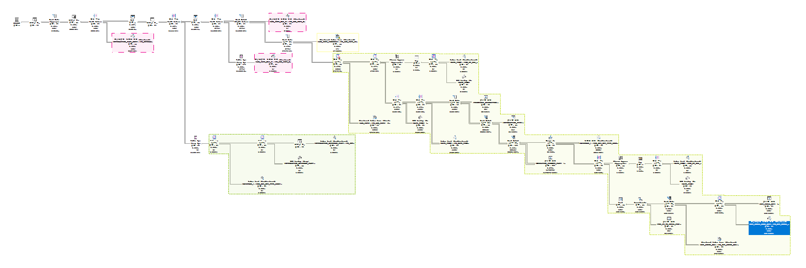
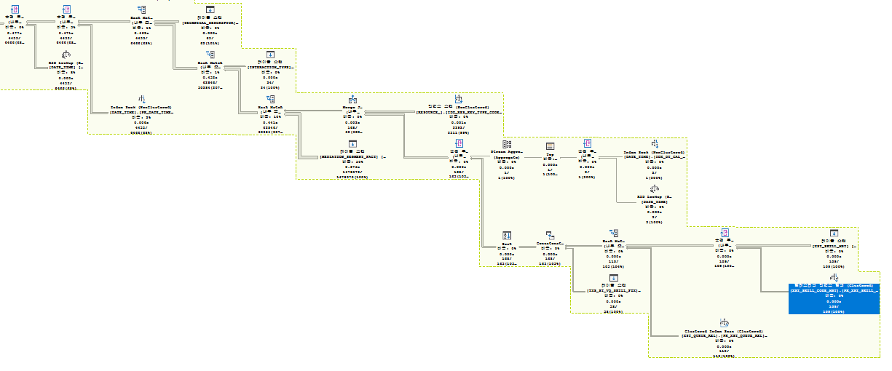

# 빠른 쿼리의 SQL Trace 분석
## Description
MS SQL이 생성한 Graphical SQL Plan의 맨 우측부터 분석을 시작하여 분할 정복 방식으로 진행하였다. SQL Plan이 제공하는 정보만을 이용하여
위쪽에 추측한 SQL문, 아래쪽에 Text SQL Plan을 작성하였다. Text SQL Plan의 화살표 우측에는 테이블 탐색 결과, 인덱스 탐색 결과,
조인 결과에 따른 Row 수를 기입하였다.
## Graphical Fastest SQL Plan from MS SQL Optimizer

## Part A

***
```oracle-sql
SELECT /*+ leading(XSM, XSCM) use_nl(XSCM PK_XST_SKILL_CODE_MST) */ XSM.SKILL_ID, XSM.SKILL_NM
FROM XST_SKILL_MST XSM, XST_SKILL_CODE_MST XSCM
WHERE XSM.SKILL_GRP_CD <> '12'
AND XSCM.CODE = XSM.SKILL_GRP_CD
AND XSCM.CLSS_CD = '1000';
```
```text
NESTED LOOP --> 109행
    TABLE FULL SCAN(XST_SKILL_MST) --> 109행
    INDEX RANGE SCAN(XST_SKILL_CODE_MST) --> 109행
```
***
```oracle-sql
SELECT /*+ leading(XSM XSCM XQM) use_nl(XSCM PK_XST_SKILL_CODE_MST) use_hash(XQM PK_XST_QUEUE_REL) */ 
XQM.RESOURCE_KEY, XSM.SKILL_ID, XSM.SKILL_NM
FROM XST_SKILL_MST XSM, XST_SKILL_CODE_MST XSCM, XST_QUEUE_REL XQM
WHERE XSM.SKILL_GRP_CD <> '12'
AND XSCM.CODE = XSM.SKILL_GRP_CD
AND XSCM.CLSS_CD = '1000'
AND XQM.SKILL_ID = XSM.SKILL_ID
AND XQM.CNFR_CLSS_CD = 'FM'
```
```text
HASH JOIN --> 110행
    NESTED LOOP --> 109행
        TABLE FULL SCAN(XST_SKILL_MST) --> 109행
        INDEX RANGE SCAN(PK_XST_SKILL_CODE_MST) --> 109행
    TABLE ACCESS BY INDEX ROWID --> 110행
        INDEX RANGE SCAN(PK_XST_QUEUE_REL) --> 228행
```
***
