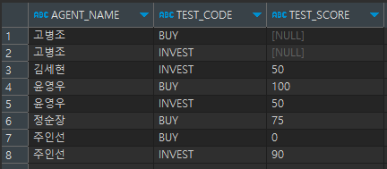
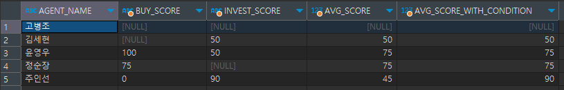
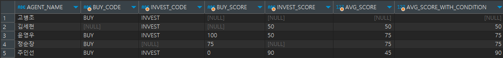

# Pivot 만들기 테스트
## 샘플 데이터


| AGENT_NAME | TEST_CODE | TEST_SCORE |
|------------|-----------|------------|
| 고병조        | BUY       | (NULL)     |
| 고병조        | INVEST    | (NULL)     |
| 김세현        | INVEST    | 50         |
| 윤영우        | BUY       | 100        |
| 윤영우        | INVEST    | 50         |
| 정순장        | BUY       | 75         |
| 주인선        | BUY       | 0          |
| 주인선        | INVEST    | 90         |

<br><br><br><br><br><br><br><br><br><br><br><br>

## Pivot 쿼리 #1
```text
SELECT 
  mt.AGENT_NAME
  ,MIN(CASE WHEN mt.TEST_CODE = 'BUY' THEN mt.TEST_SCORE ELSE NULL END) AS "BUY_SCORE"
  ,MIN(CASE WHEN mt.TEST_CODE = 'INVEST' THEN mt.TEST_SCORE ELSE NULL END) AS "INVEST_SCORE"
  ,AVG(mt.TEST_SCORE) AS "AVG_SCORE"
  ,AVG(CASE WHEN mt.TEST_SCORE != '0' THEN mt.TEST_SCORE ELSE NULL END) AS "AVG_SCORE_WITH_CONDITION"
FROM MSTR_TEST mt 
GROUP BY mt.AGENT_NAME
ORDER BY mt.AGENT_NAME 
```

## 쿼리 #1 결과


## Pivot 쿼리 #2
```text
SELECT 
  mt.AGENT_NAME
  ,MIN(CASE WHEN mt.TEST_CODE = 'BUY' THEN mt.TEST_CODE ELSE NULL END) AS "BUY_CODE"
  ,MIN(CASE WHEN mt.TEST_CODE = 'INVEST' THEN mt.TEST_CODE ELSE NULL END) AS "INVEST_CODE"
  ,MIN(CASE WHEN mt.TEST_CODE = 'BUY' THEN mt.TEST_SCORE ELSE NULL END) AS "BUY_SCORE"
  ,MIN(CASE WHEN mt.TEST_CODE = 'INVEST' THEN mt.TEST_SCORE ELSE NULL END) AS "INVEST_SCORE"
  ,AVG(mt.TEST_SCORE) AS "AVG_SCORE"
  ,AVG(CASE WHEN mt.TEST_SCORE != '0' THEN mt.TEST_SCORE ELSE NULL END) AS "AVG_SCORE_WITH_CONDITION"
FROM MSTR_TEST mt 
GROUP BY mt.AGENT_NAME
ORDER BY mt.AGENT_NAME 
```

## 쿼리 #2 결과
