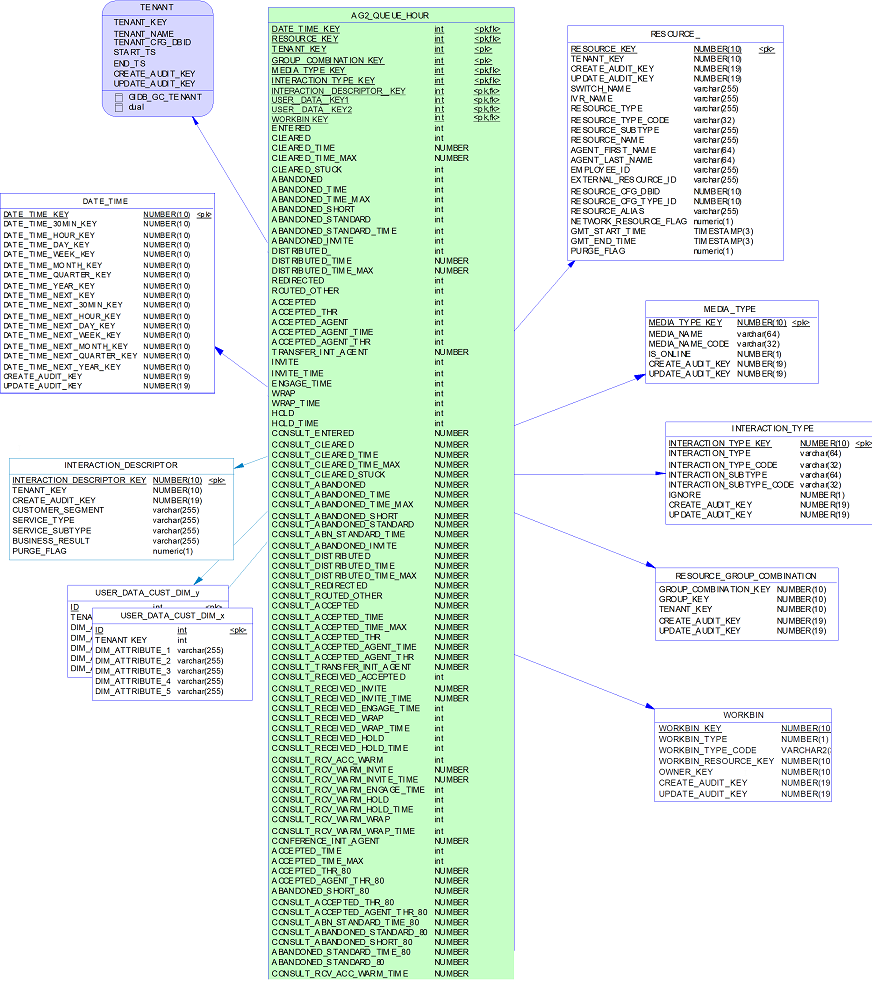
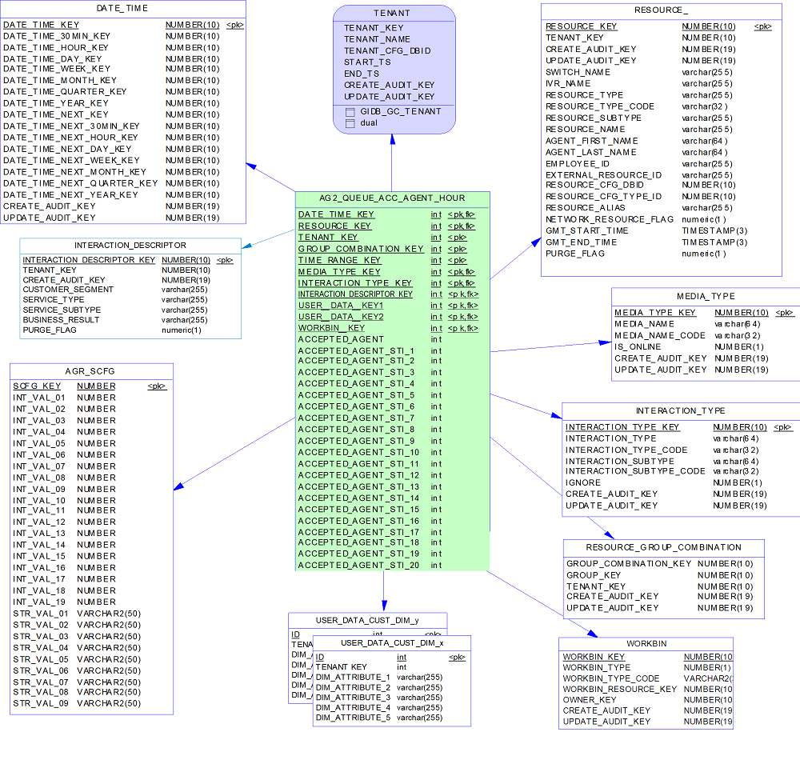
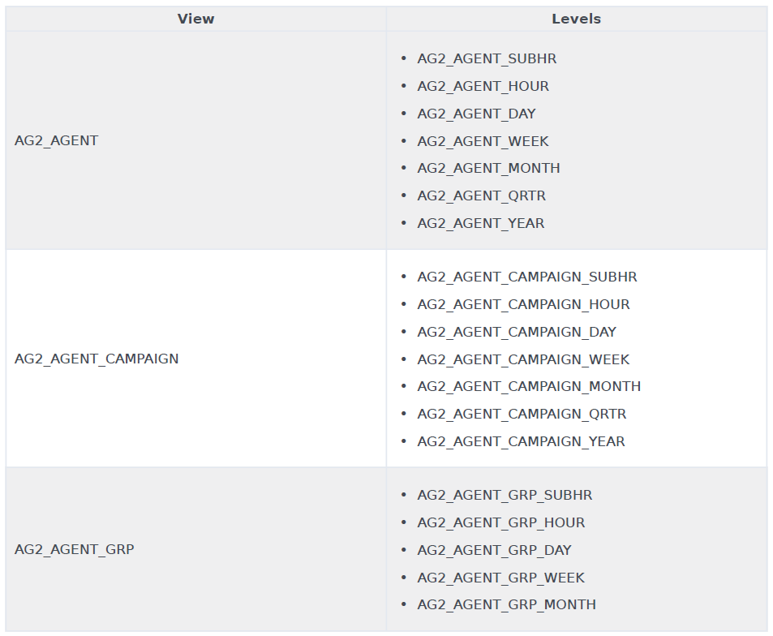
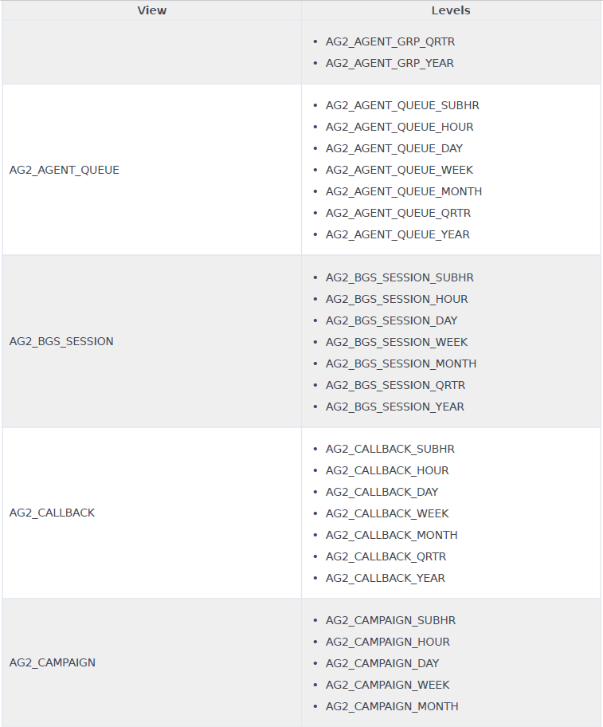
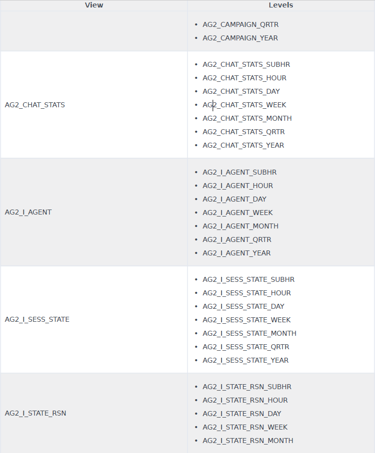
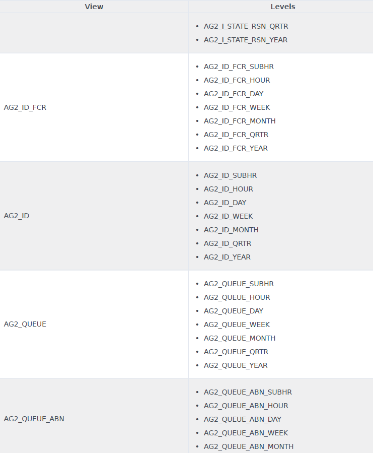
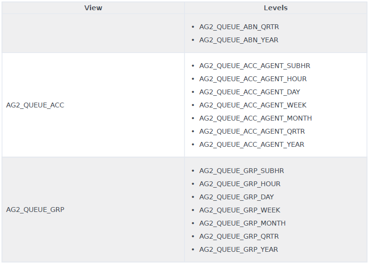

# 삼성증권 통계 리포트 쿼리 분석
## 분석 대상 View
하기 View들은 구간 기반의 집계 테이블인 AGT_* 테이블들을 대표한다.
- AG2_QUEUE_DAY
- AG2_QUEUE_ACC_AGENT_DAY
## 마지막 분석 내용
1. `USER_DATA_CUST_DIM` 테이블에는 `ID` 컬럼 값이 *-2, -1, 1, 2, 3, 4, 5, 6, 7, 8, 9*인 데이터만 있다.
2. `USER_DATA_CUST_DIM` 테이블과 조인 후에 해당 테이블에서 참조하는 컬럼은 `DIM_ATTRIBUTE_2`인데, 해당 컬럼 값은 *NO_VALUE, UNKNOWN, NONE, N, Y*이다.
3. `AG2_QUEUE_DAY` 뷰에는 3월 2일부터 `USER_DATA_KEY2` 컬럼 값이 *-2*인 데이터가 한 건도 없다. 하지만 작업일 2월 28일에는 *-2* 값도 혼재되어 있다.
4. 5초, 10초, 12초, 20초 이내로 응답한 상담원 수를 집계하는 `AG2_QUEUE_ACC_AGENT_DAY` 뷰에는 `USER_DATA_KEY2` 컬럼 값이 *-2* 뿐이다.
5. `AG2_QUEUE_DAY` 뷰와 `AG2_QUEUE_ACC_AGENT_DAY` 뷰를 USER_DATA_KEY2 컬럼으로 조인하므로 집계 값은 0이 된다.

결론 : USER_DATA_KEY2 컬럼 값으로 `AG2_QUEUE_DAY` 뷰와 `AG2_QUEUE_ACC_AGENT_DAY` 뷰를 조인할 필요가 없는 것인가,
아니면 `AG2_QUEUE_DAY` 뷰 뿐만이 아니라 `AG2_QUEUE_ACC_AGENT_DAY` 뷰에도 -2를 제외한 다른 값들이 있어야 하는 것인가?
## AG2_QUEUE_HOUR 정보

## AG2_QUEUE_ACC_AGENT_DAY 정보

## 컬럼 설명
- USER_DATA_KEY1 : The surrogate key that is used to join this aggregate table to a custom user data dimension table to identify attached data that has been assigned to the interaction.
- USER_DATA_KEY2 : 	The surrogate key that is used to join this aggregate table to a custom user data dimension table to identify attached data that has been assigned to the interaction.
## USER_DATA_CUST_DIM_1 정보
### Description
The table stores up to five attributes that are based on KVPs that are associated with interactions and are populated according to configurable propagation rules. Each row describes a combination of user-defined custom attributes that characterize the interaction.
### Column List
- ID : integer
- TENANT_KEY : integer
- DIM_ATTRIBUTE_1 Through DIM_ATTRIBUTE_5 : varchar(255)
- CREATE_AUDIT_KEY : numeric(19)
## Changes to User Data Tables and Fields
Release 8.x provides a unified mechanism for processing user data from both EventUserEvents and call-based TEvents,
with flexible data storage that you can configure according to the number and types of user data that is captured in
your contact center environment. Genesys Info Mart 8.x also processes the user data that arrives after call completion
and updates call records accordingly.

A customizable database schema enables you to treat each KVP field as either a fact or a dimension and to store
user-data KVPs in a configurable number of user-data dimensions and fact extension tables. In particular, low-cardinality
string user data that is associated with the interaction resource can now be linked to the facts through the new
IRF_USER_DATA_KEYS table and stored in a large number of the `USER_DATA_CUST_DIM_*` dimensions. Numeric user data and
high-cardinality string user data that is associated with the interaction resource can now be stored in the new,
predefined IRF_USER_DATA_GEN_1 table as well as in any number of IRF_USER_DATA_CUST_* fact extension tables that you
can add to the schema.
## RAA Views
```text
This document provides subject area diagrams and descriptions only for the hour-level aggregation
tables and views (AGT_*_HOUR tables, and AG2_*_HOUR views). The AG2_* views represent the corresponding AGT_* aggregate
tables.
```
  
  
  
  
