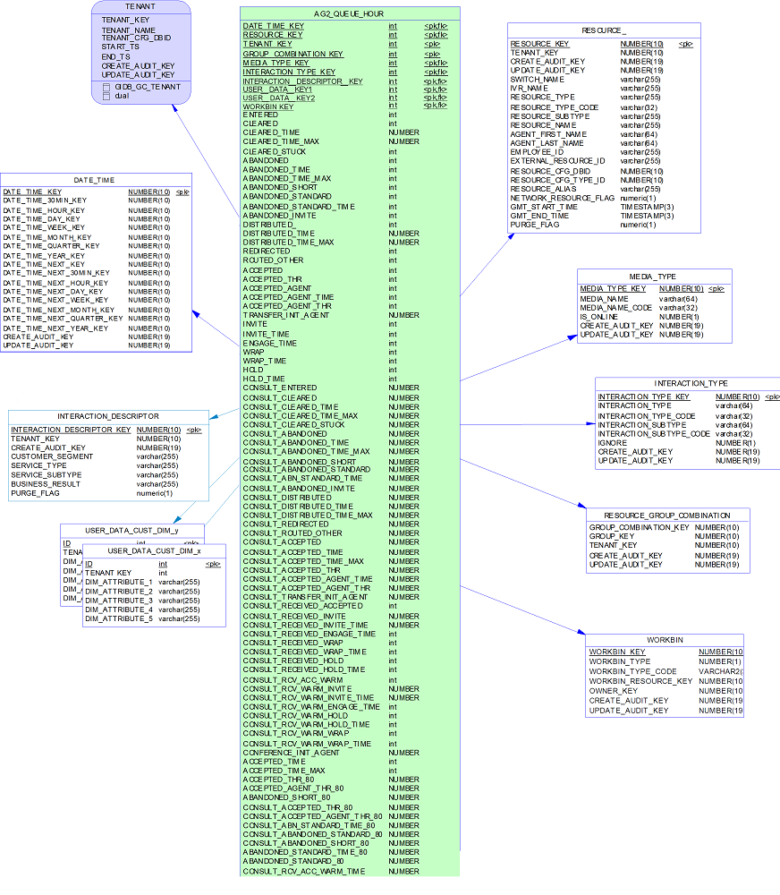

# AGT_QUEUE
- AGT_QUEUE_SUBHR
- AGT_QUEUE_HOUR
- AGT_QUEUE_DAY
- AGT_QUEUE_WEEK
- AGT_QUEUE_MONTH
- AGT_QUEUE_QRTR
- AGT_QUEUE_YEAR



```oracle-sql
SELECT
    AQD.DATE_TIME_KEY,
    AQD.GROUP_COMBINATION_KEY,
    AQD.RESOURCE_KEY,
    AQD.INTERACTION_DESCRIPTOR_KEY,
    AQD.TENANT_KEY,
    AQD.WORKBIN_KEY,
    AQD.MEDIA_TYPE_KEY,
    AQD.INTERACTION_TYPE_KEY,
    AQD.USER_DATA_KEY1,
    -2 AS USER_DATA_KEY2,
    MAX(AQD.USER_DATA_GEN_KEY1) AS USER_DATA_GEN_KEY1,
    MAX(AQD.USER_DATA_GEN_KEY2) AS USER_DATA_GEN_KEY2,
    SUM(AQD.ENTERED) AS ENTERED,
    SUM(AQD.CLEARED) AS CLEARED,
    SUM(AQD.CLEARED_TIME) AS CLEARED_TIME,
    MAX(AQD.CLEARED_TIME_MAX) AS CLEARED_TIME_MAX,
    SUM(AQD.CLEARED_STUCK) AS CLEARED_STUCK,
    SUM(AQD.ABANDONED) AS ABANDONED,
    SUM(AQD.ABANDONED_TIME) AS ABANDONED_TIME,
    MAX(AQD.ABANDONED_TIME_MAX) AS ABANDONED_TIME_MAX,
    SUM(AQD.ABANDONED_SHORT) AS ABANDONED_SHORT,
    SUM(AQD.ABANDONED_STANDARD) AS ABANDONED_STANDARD,
    SUM(AQD.ABANDONED_STANDARD_TIME) AS ABANDONED_STANDARD_TIME,
    SUM(AQD.ABANDONED_INVITE) AS ABANDONED_INVITE,
    SUM(AQD.DISTRIBUTED_) AS DISTRIBUTED_,
    SUM(AQD.DISTRIBUTED_TIME) AS DISTRIBUTED_TIME,
    MAX(AQD.DISTRIBUTED_TIME_MAX) AS DISTRIBUTED_TIME_MAX,
    SUM(AQD.REDIRECTED) AS REDIRECTED,
    SUM(AQD.ROUTED_OTHER) AS ROUTED_OTHER,
    SUM(AQD.ACCEPTED) AS ACCEPTED,
    SUM(AQD.ACCEPTED_THR) AS ACCEPTED_THR,
    SUM(AQD.ACCEPTED_AGENT) AS ACCEPTED_AGENT,
    SUM(AQD.ACCEPTED_AGENT_TIME) AS ACCEPTED_AGENT_TIME,
    SUM(AQD.ACCEPTED_AGENT_THR) AS ACCEPTED_AGENT_THR,
    SUM(AQD.DEFERRED) AS DEFERRED,
    SUM(AQD.TRANSFER_INIT_AGENT) AS TRANSFER_INIT_AGENT,
    SUM(AQD.INVITE) AS INVITE,
    SUM(AQD.INVITE_TIME) AS INVITE_TIME,
    SUM(AQD.ENGAGE_TIME) AS ENGAGE_TIME,
    SUM(AQD.WRAP) AS WRAP,
    SUM(AQD.WRAP_TIME) AS WRAP_TIME,
    SUM(AQD.HOLD) AS HOLD,
    SUM(AQD.HOLD_TIME) AS HOLD_TIME,
    SUM(AQD.CONSULT_ENTERED) AS CONSULT_ENTERED,
    SUM(AQD.CONSULT_CLEARED) AS CONSULT_CLEARED,
    SUM(AQD.CONSULT_CLEARED_TIME) AS CONSULT_CLEARED_TIME,
    MAX(AQD.CONSULT_CLEARED_TIME_MAX) AS CONSULT_CLEARED_TIME_MAX,
    SUM(AQD.CONSULT_CLEARED_STUCK) AS CONSULT_CLEARED_STUCK,
    SUM(AQD.CONSULT_ABANDONED) AS CONSULT_ABANDONED,
    SUM(AQD.CONSULT_ABANDONED_TIME) AS CONSULT_ABANDONED_TIME,
    MAX(AQD.CONSULT_ABANDONED_TIME_MAX) AS CONSULT_ABANDONED_TIME_MAX,
    SUM(AQD.CONSULT_ABANDONED_SHORT) AS CONSULT_ABANDONED_SHORT,
    SUM(AQD.CONSULT_ABANDONED_STANDARD) AS CONSULT_ABANDONED_STANDARD,
    SUM(AQD.CONSULT_ABN_STANDARD_TIME) AS CONSULT_ABN_STANDARD_TIME,
    SUM(AQD.CONSULT_ABANDONED_INVITE) AS CONSULT_ABANDONED_INVITE,
    SUM(AQD.CONSULT_DISTRIBUTED) AS CONSULT_DISTRIBUTED,
    SUM(AQD.CONSULT_DISTRIBUTED_TIME) AS CONSULT_DISTRIBUTED_TIME,
    MAX(AQD.CONSULT_DISTRIBUTED_TIME_MAX) AS CONSULT_DISTRIBUTED_TIME_MAX,
    SUM(AQD.CONSULT_REDIRECTED) AS CONSULT_REDIRECTED,
    SUM(AQD.CONSULT_ROUTED_OTHER) AS CONSULT_ROUTED_OTHER,
    SUM(AQD.CONSULT_ACCEPTED) AS CONSULT_ACCEPTED,
    SUM(AQD.CONSULT_ACCEPTED_TIME) AS CONSULT_ACCEPTED_TIME,
    MAX(AQD.CONSULT_ACCEPTED_TIME_MAX) AS CONSULT_ACCEPTED_TIME_MAX,
    SUM(AQD.CONSULT_ACCEPTED_THR) AS CONSULT_ACCEPTED_THR,
    SUM(AQD.CONSULT_ACCEPTED_AGENT_TIME) AS CONSULT_ACCEPTED_AGENT_TIME,
    SUM(AQD.CONSULT_ACCEPTED_AGENT_THR) AS CONSULT_ACCEPTED_AGENT_THR,
    SUM(AQD.CONSULT_TRANSFER_INIT_AGENT) AS CONSULT_TRANSFER_INIT_AGENT,
    SUM(AQD.CONSULT_RECEIVED_ACCEPTED) AS CONSULT_RECEIVED_ACCEPTED,
    SUM(AQD.CONSULT_RECEIVED_INVITE) AS CONSULT_RECEIVED_INVITE,
    SUM(AQD.CONSULT_RECEIVED_INVITE_TIME) AS CONSULT_RECEIVED_INVITE_TIME,
    SUM(AQD.CONSULT_RECEIVED_ENGAGE_TIME) AS CONSULT_RECEIVED_ENGAGE_TIME,
    SUM(AQD.CONSULT_RECEIVED_WRAP) AS CONSULT_RECEIVED_WRAP,
    SUM(AQD.CONSULT_RECEIVED_WRAP_TIME) AS CONSULT_RECEIVED_WRAP_TIME,
    SUM(AQD.CONSULT_RECEIVED_HOLD) AS CONSULT_RECEIVED_HOLD,
    SUM(AQD.CONSULT_RECEIVED_HOLD_TIME) AS CONSULT_RECEIVED_HOLD_TIME,
    SUM(AQD.CONSULT_RCV_ACC_WARM) AS CONSULT_RCV_ACC_WARM,
    SUM(AQD.CONSULT_RCV_ACC_WARM_TIME) AS CONSULT_RCV_ACC_WARM_TIME,
    SUM(AQD.CONSULT_RCV_WARM_INVITE) AS CONSULT_RCV_WARM_INVITE,
    SUM(AQD.CONSULT_RCV_WARM_INVITE_TIME) AS CONSULT_RCV_WARM_INVITE_TIME,
    SUM(AQD.CONSULT_RCV_WARM_ENGAGE_TIME) AS CONSULT_RCV_WARM_ENGAGE_TIME,
    SUM(AQD.CONSULT_RCV_WARM_HOLD_TIME) AS CONSULT_RCV_WARM_HOLD_TIME,
    SUM(AQD.CONSULT_RCV_WARM_HOLD) AS CONSULT_RCV_WARM_HOLD,
    SUM(AQD.CONSULT_RCV_WARM_WRAP) AS CONSULT_RCV_WARM_WRAP,
    SUM(AQD.CONSULT_RCV_WARM_WRAP_TIME) AS CONSULT_RCV_WARM_WRAP_TIME,
    SUM(AQD.CONFERENCE_INIT_AGENT) AS CONFERENCE_INIT_AGENT,
    SUM(AQD.ACCEPTED_TIME) AS ACCEPTED_TIME,
    MAX(AQD.ACCEPTED_TIME_MAX) AS ACCEPTED_TIME_MAX,
    MAX(AQD.GPM_RESULT_KEY) AS GPM_RESULT_KEY,
    MAX(AQD.GPM_PREDICTOR_KEY) AS GPM_PREDICTOR_KEY,
    MAX(AQD.GPM_MODEL_KEY) AS GPM_MODEL_KEY,
    SUM(AQD.GPM_AGENT_SCORE) AS GPM_AGENT_SCORE,
    SUM(AQD.GPM_ACTIVE) AS GPM_ACTIVE,
    SUM(AQD.GPM_ERROR) AS GPM_ERROR
FROM AGT_QUEUE_DAY AQD
WHERE AQD.DATE_TIME_KEY >= dbo.F_D2U(20230228)
AND AQD.DATE_TIME_KEY < dbo.F_D2U(:작업일)
GROUP BY
    AQD.DATE_TIME_KEY,
    AQD.GROUP_COMBINATION_KEY,
    AQD.RESOURCE_KEY,
    AQD.INTERACTION_DESCRIPTOR_KEY,
    AQD.TENANT_KEY,
    AQD.WORKBIN_KEY,
    AQD.MEDIA_TYPE_KEY,
    AQD.INTERACTION_TYPE_KEY,
    AQD.USER_DATA_KEY1
```
추후 `:작업일`을 실제 작업일로 교체